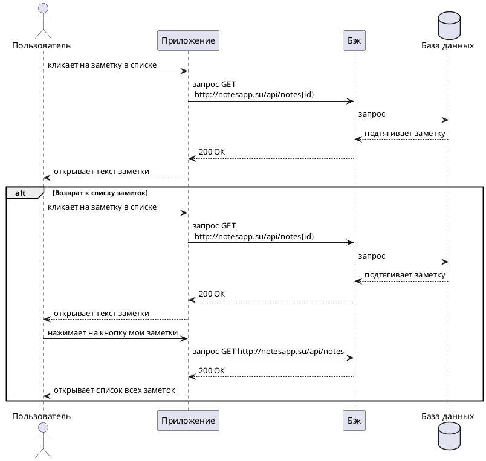

---
tags:
  - diagrams
---

# Сценарии приложения Нотсапп

## **Пользовательский сценарий «Просмотр заметки»**

*Действующие лица*:

1. Пользователь.

2. Приложение.

3. Бэк.

4. База данных.

!!! warning "Внимание"
    Предварительные условия: пользователь находится на главном экране. Список заметок отображается по умолчанию при входе в приложение.

???+ note "Выходные условия"
    На экране отображается текст нужной заметки.

**Основной сценарий**

* Пользователь кликает на заметку в списке.

* Приложение возвращает полное содержимое заметки для отображения в режиме просмотра/редактирования (метод `GET http://notesapp.su/api/notes{id}`).

* Успешно получена заметка ответ 200.
 
* Пользователь просматривает заметку.

**Альтернативный сценарий**

* Пользователь кликает на заметку в списке.

* Приложение возвращает полное содержимое заметки для отображения в режиме просмотра/редактирования (метод `GET http://notesapp.su/api/notes{id}`).

* Успешно получена заметка ответ 200.
 
* Пользователь просматривает заметку.

* Пользователю доступны кнопки **Редактировать**, **Удалить**, **мои заметки** под окном с текстом заметки.

* Для возврата к списку всех заметок пользователь нажимает на кнопку **мои заметки**.

* Приложение возвращает список всех заметок для отображения в основном интерфейсе (метод `GET http://notesapp.su/api/notes`).

* Успешно получен список заметок ответ 200.

* Пользователь видит список всех заметок.


---

### Диаграмма последовательности


??? note "Код диаграммы"
    ```plantuml
    @startuml
    actor Пользователь
    participant Приложение
    participant Бэк
    database "База данных"

    Пользователь -> Приложение: кликает на заметку в списке
    Приложение -> Бэк: запрос GET\n http://notesapp.su/api/notes{id}
    Бэк -> "База данных": запрос
    "База данных" --> Бэк: подтягивает заметку
    Бэк --> Приложение: 200 ОК
    Пользователь <-- Приложение: открывает текст заметки

    alt Возврат к списку заметок
    Пользователь -> Приложение: кликает на заметку в списке
    Приложение -> Бэк: запрос GET\n http://notesapp.su/api/notes{id}
    Бэк -> "База данных": запрос
    "База данных" --> Бэк: подтягивает заметку
    Бэк --> Приложение: 200 ОК
    Пользователь <-- Приложение: открывает текст заметки
    Пользователь -> Приложение: нажимает на кнопку мои заметки
    Приложение -> Бэк: запрос GET http://notesapp.su/api/notes
    Бэк --> Приложение: 200 ОК
    Пользователь <- Приложение: открывает список всех заметок
    end alt

    @enduml
    ``` 

 


