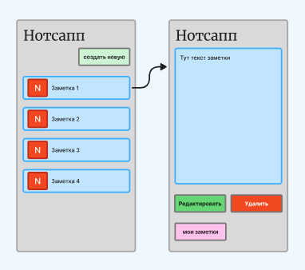

---
tags:
  - diagrams
---

# Сценарии приложения Нотсапп

## **Пользовательский сценарий «Просмотр заметки»**

*Действующие лица*:

1. Пользователь.

2. Приложение.

3. Бэк.

4. База данных.

!!! warning "Внимание"
    Предварительные условия: пользователь находится на главном экране.

???+ note "Выходные условия"
    На главном экране отображается список заметок.

## **Основной сценарий**

* Пользователь нажимает на заметку 1.

* Приложение отправляет запрос Бэку на открытие заметки 1.

* Заметка 1 подтягивается из Базы данных.

* Приложение открывает заметку с текстом в режиме просмотра.

* Пользователь просматривает заметку.

* Пользователю доступны кнопки **Редактировать**, **Удалить**, **мои заметки**.

---

## **Пользовательский сценарий «Редактирование заметки»**

==Сценарий в разработке==

---

## **Пользовательский сценарий «Удаление заметки»**

~~Сценарий в разработке~~

